# aguacate-aljoan
Mini Proyecto UOC_1

## Reglas de Organización del Equipo

1. **Flujo de Ramas:** Cada miembro del equipo trabaja en su propia rama.
2. **Push a Ramas Personales:** Los cambios se envían desde el entorno local a la rama personal de cada miembro.
3. **Merge a la Rama dev:** Verifica tus cambios en tu rama en GitHub, luego inicia un merge hacia la rama dev.
4. **Merge a main:** Solo Andrés es responsable de hacer los merges a la rama main.
5. **Gestión de Tareas:** Las tareas están organizadas en el backlog. Asigna tareas a tu nombre y pásalas a "En Progreso" cuando comiences a trabajar.
6. **Tipo de paneles:** To Do, In Progress, Done, Discoveries
7. **Commits Frecuentes y Push Diario:** Realiza commits frecuentemente para documentar el progreso y haz push al menos una vez al día o al completar una tarea.
8. **Un Notebook por Tarea:** Usa un solo Jupyter Notebook por cada tarea o issue.
9. **Reuniones Diarias:** Asiste a reuniones diarias para revisar avances y discutir cualquier problema. Canal de comunicacion Google Meet cuenta de UOC. Comentarios en grupo compartido de Wapp

## Entorno de control de versiones y colaboración

Utilización de GitHub para el Control de Versiones definiendo una rama para cada participante de grupo, una rama de 'dev' y la rama 'main' como producción.

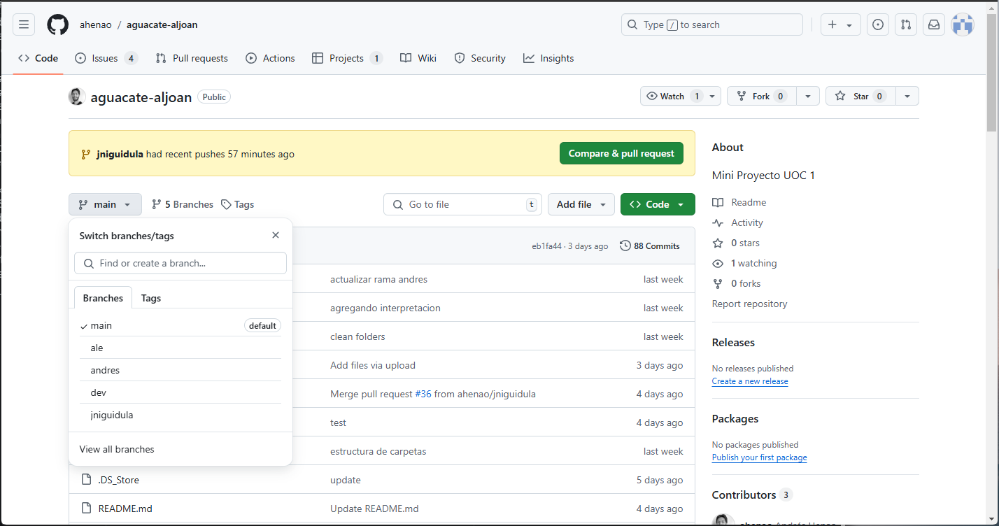


Utilización de GitHub Projects para la creación, asignación, ejecución y finalización de tareas (backlog). Columna especifica para Discoveries: información sobre investigaciones sobre los datos.

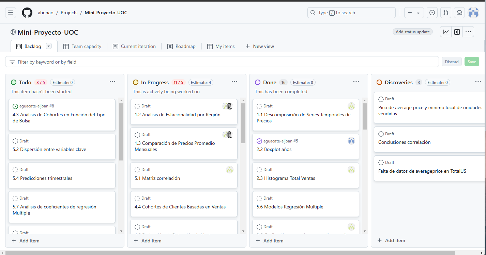


## utils

Hemos creado este folder para compartir código que se reuse en todo el proyecto.
Funciones en data.py ([data utils](https://github.com/ahenao/aguacate-aljoan/blob/main/utils/data.py)): 
- obtener_nuevo_avocado(): devuelve el nuevo dataframe con la clasificación de regiones, agrupaciones y ciudades
- imputar_fechas(): imputa valores a tres fechas que no aparecen en el dataset original por promedio de una semana anterios y la semana posterior. Esta función ya realiza un llamado a obtener_nuevo_avocado() para trabajar con los labels de regiones.
  ```
    missing_dates = ['2015-12-06', '2017-06-18', '2017-06-25']
    region = 'WestTexNewMexico'
    avocado_type = 'organic'
  ```

Para usar los módulos de utils en scripts se hace 
```
from utils.data import obtener_nuevo_avocado, impotar_fechas
```
y para usarlos desde jupyter notebook, hay que agregar el path:

```
import sys, os
sys.path.append('../../../aguacate-aljoan/')  # Adjust to the path where utils is located
from utils.data import obtener_nuevo_avocado, imputar_fechas

nuevo__df = obtener_nuevo_avocado()
imputar_fechas_df = imputar_fechas()
```
## Analisis e investigaciones de los datos en avocados.csv

La información en el archivo avocados.csvincluye los codigos de clasificación de aguacates usando codigos PLU (codigo de búsqueda de precio en íngles).

Estos codigos son de la variedad Hass:

- 4046 - Hass Small
- 4225 - Hass Large
- 4770 - Hass Extra Large

Existen codigos adicionales Hass:

- 94046 - Organic Hass Small
- 94225 - Organic Hass Large
- 94770 - Organic Hass Extra Large

Codigos de la variedad GEM:

- 3509 - variedad GEM de todos los tamaños
- 93509 -veriedad GEM organic de todos los tamaños

Codigos de la variedad Greenskins

- 4222 - Greenskin Small
- 94222 - Organic Greenskin Small
- 4224 - Greenskin Large
- 94224 - Organic Greenskin Large

Referencia:
<https://californiaavocado.com/retail/avocado-plus/#:~:text=PLU%20numbers%20are%20used%20to,the%20regular%20four%2Ddigit%20code>

El *avocado.csv* que estamos analizando solo incluye los codigos PLU Hass para avocado convencionales, aunque tiene otra columna de clasificación para avocado convencional y organico usando los mismo codigos.

Se puede observar en las columnas de datos:

|Date|AveragePrice|Total Volume|4046|4225|4770|Total Bags|Small Bags|Large Bags|XLarge Bags|type|year|region|region_type|
|-----|-----|-----|-----|-----|-----|-----|-----|-----|-----|-----|-----|-----|-----|
|2015-1-04|1.33|9213.49|3737.52|4327.52|0.00|1158.45|1158.45|0.00|0.0|organic|20150|Sacramento|City|
|....|....|....|....|....|....|....|....|....|....|....|....|....|....|

Según la documentación, Total Volume es el total de volumen de ventas de aguacates con los PLUs 4046, 4225 y 4770, pero con coinciden la suma de volumenes por PLU con Total Volume. Dado que hay mas tipos/PLUs, es posible que hay PLUs que cuentan para el Total Volume pero no se han incluido en el csv.

Otro punto de interes es que ciertas variedades, como el Hass, tienden a dar buenos rendimientos solo en años alternos. Después de una temporada con un bajo rendimiento, debido a factores como el frío (al cual el aguacate no tolera bien), los árboles tienden a producir abundantemente en la siguiente temporada. Esta cosecha abundante agota los carbohidratos almacenados, lo que resulta en un menor rendimiento en la siguiente temporada, y así se establece el patrón de alternancia en la producción.

Referencia:
<https://www.agmrc.org/commodities-products/fruits/avocados#:~:text=They%20are%20thought%20to%20have,followed%20by%20Florida%20and%20Hawaii>

Durante temporadas de bajo rendimiento de los arboles, se compensa la baja producción local (EE.UU) con las importaciones de aguacates procedentes de otros paises como Mejico.

En los datos de *avocado.csv*, se observa un incremento en los precios del aguacate durante el año 2017. Hemos intentado investigar las causas:

La volatilidad del mercado de aguacates en 2017 se debió a varios factores clave:

Alta demanda global: El consumo de aguacates aumentó significativamente en países como Estados Unidos, Europa y Asia.
Este “boom” del aguacate se debió a su popularidad en la gastronomía y su versatilidad en diferentes platos.

Problemas climáticos: En California, uno de los principales productores de aguacates, hubo una ola de calor que afectó la floración y redujo la producción a la mitad. Esto creó una escasez que elevó los precios.

Transición de cosechas: Hubo un período de transición entre la cosecha anterior y la nueva, lo que también contribuyó a la escasez temporal y al aumento de precios.

Dependencia de México: México es el mayor productor de aguacates del mundo, y cualquier interrupción en su suministro, ya sea por razones climáticas, huelgas o problemas logísticos, afecta significativamente el mercado global.

Estos factores combinados llevaron a una gran volatilidad en los precios del aguacate durante 2017, lo que se reflejó en los datos de ventas utilizados.

Referencia: <https://www.bbc.com/mundo/noticias-49209380>

## Asunciones tomadas

Se ha encontrado la combinatoria de Regiones que compenen el valor del TotalUs y se ha decidido agregar una columna que clasifica las regiones en Cities, GreaterRegions, States, TotalUS para realizar los analisis de cada segmentacion en particular sin mezclar estas distintas segmentaciones


En cada Jupyter se incluye esta linea de codigo donde se puede ir cambiando la segmentacion para realizar cada analisis

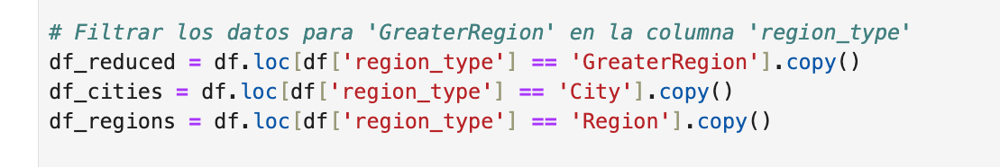


## Análisis de Series

**Analisis de AveragePrice**

En el gráfico abajo, se puede observar el incremento del precio del aguacate durante el periodo 2017 debido a la volatilidad del mercado de agucates explicado

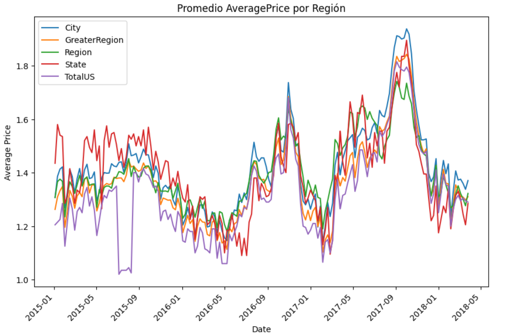

Analisis por segmentacion GreaterRegion

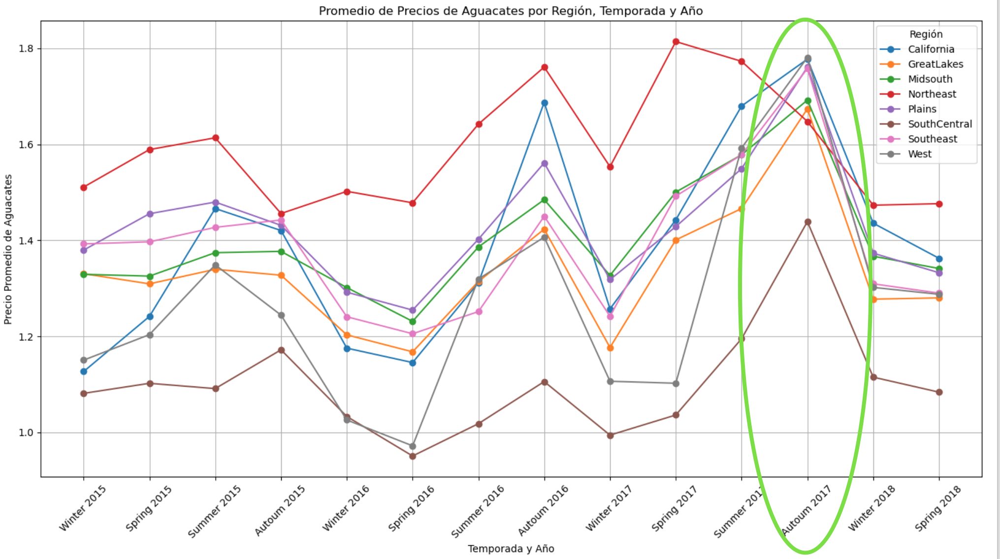

Analisis por tipo de aguacate

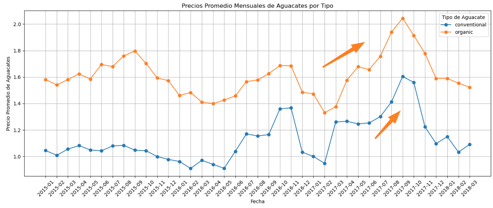


**Analisis de series temporales**

En el analisis del dataset se identifico que las entradas al dataset son todos los domingos, 1 vez a la semana  a partir de esto se define la periodicidad en 52 semanas que es lo que tiene 1 año


*Serie Original*

Este grafico es con la segmentacion GreaterRegion

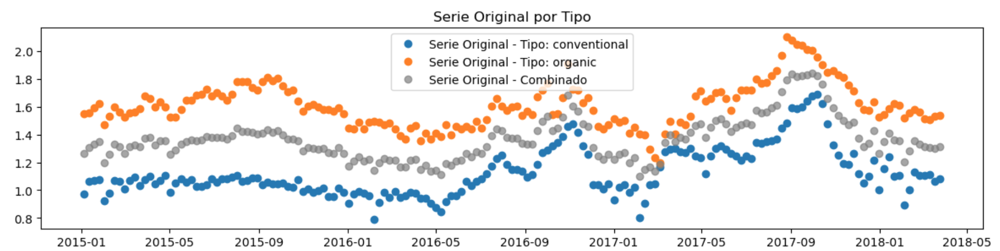

Si se hace analizando TotalUS, se observan unos outliers en el aguacate organico

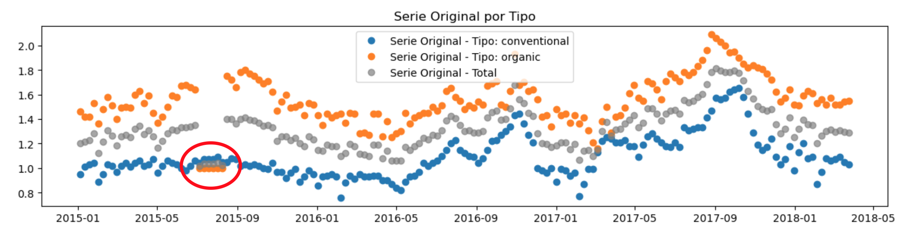

*Tendencia AveragePrice*


*Estacionalidad AveragePrice*

Se observan picos en fin de verano/otoño y valles en invierno

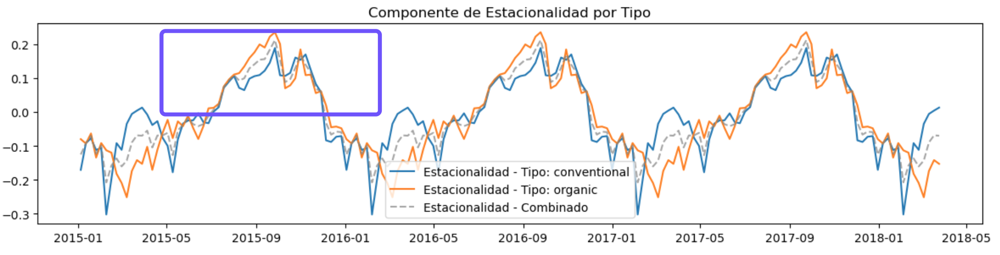


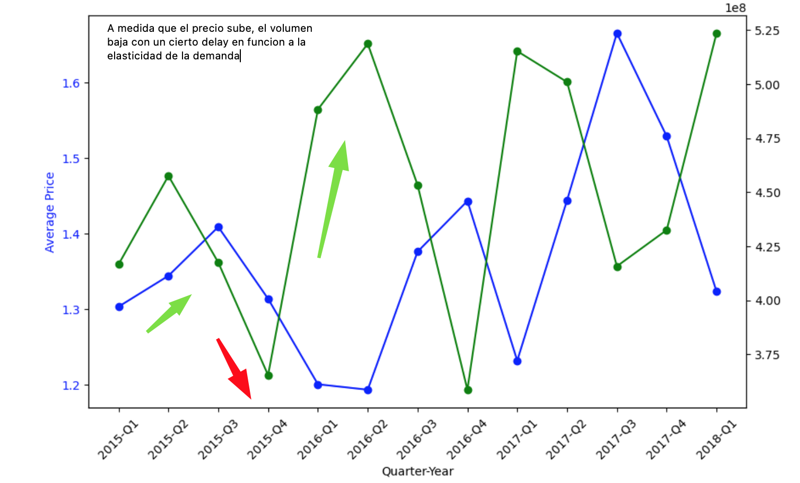


## Elasticidad

Sin embargo, la elasticidad volumen contra precio muestra que aguacates organicos (-1.5) es algo menos elástico comparado con aguacates convencionels (-2.5) a la demanda comparado con los convencionales:

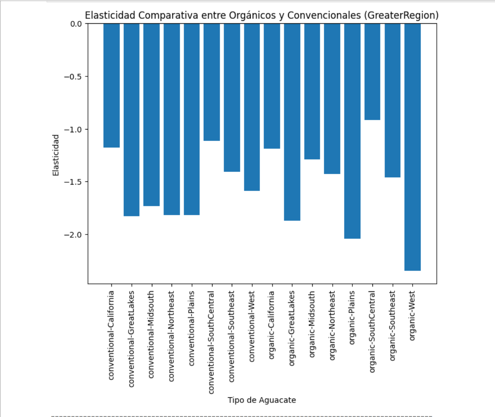

### Interpretación de Valores de Elasticidad Negativa

Demanda Elástica: Si el valor de elasticidad es menor que -1 (por ejemplo, -1.5), la demanda se considera elástica, **lo que significa que un pequeño aumento en el precio conduce a una disminución proporcionalmente mayor en la cantidad demandada**. En este caso, los consumidores son relativamente sensibles a los cambios de precio.

Demanda Inelástica: Si el valor de elasticidad está entre 0 y -1 (por ejemplo, -0.5), la demanda es inelástica. Aquí, los cambios en el precio tienen un efecto menor en la cantidad demandada, lo que sugiere que los consumidores son menos sensibles a los cambios de precio para los aguacates.

Demanda Perfectamente Inelástica: Una elasticidad de 0 implicaría que la cantidad demandada no cambia independientemente de los cambios de precio, lo cual es raro para bienes como los aguacates.

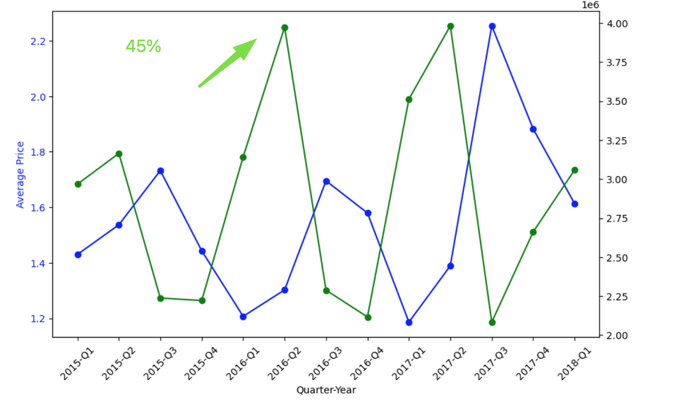

Luego del analisis de sensibilidad y las conclusiones encontradas respecto a la alta sensibilidad en el cohorte organic-West, se realiza la misma grafica avg price vs total volume filtrando solo este cohorte y se observa que los picos son mas pronunciados en este cohorte en particular

### Analisis de Cohortes

Los cohortes que tomaremos para el analisis del retention rate son los mismos que utilizaremos para las predicciones dados las diferencias en ordenes de magnitud de organicos y convencionales en volumen.
Entonces seran type-region


En funcion a lo observado aqui, hacemos el mismo analisis filtrando ahora por ciudades para ver en que ciudades hay un boom de ventas de aguacate organico en la region NorthEast. Siendo el retention rate 8, es decir las ventas iniciales en 2015, fueron 8 veces mas altas al final del periodo.


No tenemos la composicion exacta de cada greater region en ciudades, pero podemos observar que 5 de los 10 cohortes que tuvieron tasa de retencion mas alta son correspondientes a ciudades que son geograficamente de la greater region "NorthEast". Estas son: Boston, New York, Philadelphia, Pittsburg, Syracuse. Siendo la mas importante en terminos de retention rate Boston.


## Analisis de Regresión

Analizando los ordenes de magnitud los volumenes de ventas de los aguacates organicos son muy inferiores a los del convencional, es por esto que se trabajo unicamente con la evolucion de precios del convencional


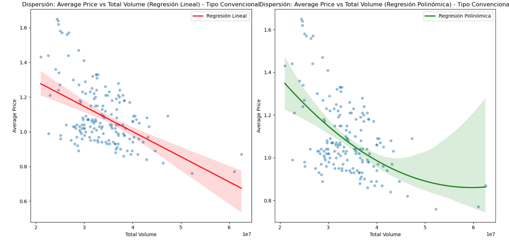


## Predicción mensual

Hemos usado una libreria opensource: [Nixtla/statsforecast](https://github.com/Nixtla/statsforecast) para realizar predicciones mensuales del dataset avocado.csv. 
Haciendo uso del modelo ARIMA (AutoRegressive Integrating MovingAverages) para predecir la variable **Total_Volume** para diferentes series agrupadas por tipo de aguacate (orgánico/convencional) y para regiones agrupadas:

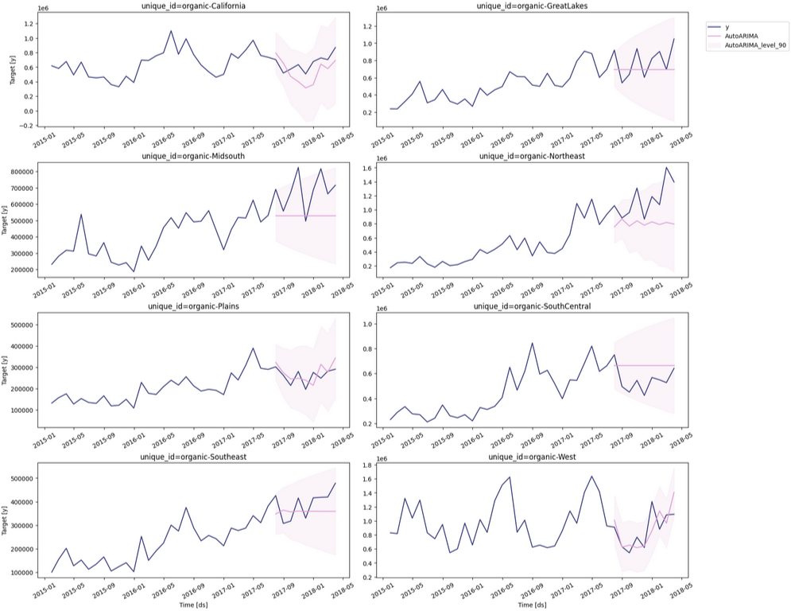

La línea azul (y) representa los datos reales. realizamos un entrenamiento del modelo con datos del 2015.01 hasta 2017.07, y se realizaron predicciones desde 2017.08 hasta 2018.03 (para los cuales tenemos datos). Las predicciones junto a un intervalo de confianza del 90% se muestran en rosa. En algunos casos, las predicciones capturan las fluctuaciones (ver California), mientras en otros casos, sólo captura un rango de valores (que dentro del intervalo de confianza son acertados) sin más detalle en fluctuaciones inter-mensuales (ver SouthCentral). 

También realizamos predicciones mensuales para TotalUS (una sola serie temporal, en lugar de 8 en el caso de regiones agrupadas). La siguiente tabla resume el MAPE (Error Absoluto Medio Porcentual):

| Error MAPE| Valor [%] | 
|----------|----------|
| Orgánico por regiones     | 22.00 | 
| Convencional por regiones | 21.31 | 
| Orgánico TotalUS          | 22.35 | 
| Convencional TotalUS      | 21.77 | 

Lo que pudimos observar es que no hay gran diferencia para un modelo de regiones y otro de TotalUS respecto al error. Lo segundo, es que la precisión del modelo ARIMA para las predicciones hechas ronda el 20%. Aún hay márgen de mejora para las predicciones (Por ejemplo probar otros modelos de regresión, o incluir variables exógenas)

### Test con variable Exógena

En una predicción de series temporales pueden usarse variables exógenas como el clima, indicadores económicos, o eventos externos para ayudar a identificar tendencias de la variable a predecir. A continuación haremos un test en nuestras prediciones de la variable **Total_Volume**, esta vez usaremos la variable **AveragePrice** como variable exógena. Haremos predicciones de 15 meses a partir de 2017.02 (lo que incluye una región problemática por la variación de producción de aguacates por causas climáticas y otras varias). Este es un ejercicio teórico, ya que las variables exógenas también deben estar disponibles como predicción a futuro. Sería difícil predecir el precio del aguacate. Sin embargo, el precio si que podría estar ligado a su vez a otras variables exógenas típicas como lo son el clima, los indicadores económicos, etc (que tipicamente pueden encontrarse predicciones acertadas a cortos tiempos, por ejemplo ventana de semanas o máx. tres meses).
### Predicción sin variable exógena:


### Predicción con variable exógena:
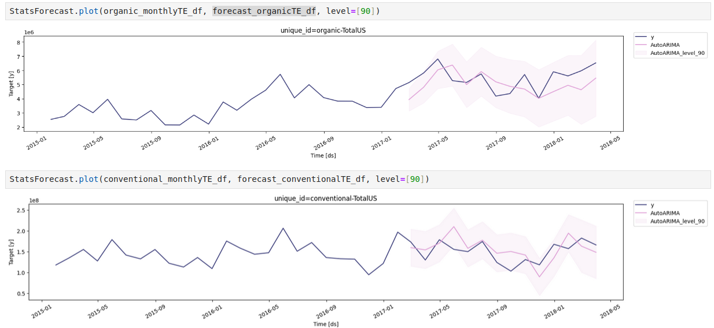

Las diferencias gráficas son sutiles, pero se onbservan algunas predicciones más cercanas a los valores reales. En la siguiente tabla se hace evidente la mejora en la predicción del modelo, sobre todo para el aguacate convencional.

| Error MAPE| Valor [%] | 
|----------|----------|
| Orgánico sin exógena     | 16.02 | 
| Convencional sin exógena | 33.07 | 
| Orgánico con exógena         | 14.75 | 
| Convencional con exógena      | 16.70 | 
