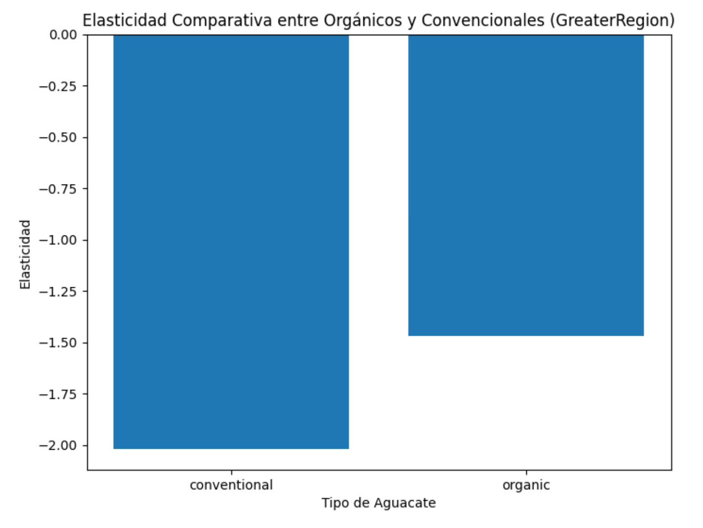

# aguacate-aljoan
Mini Proyecto UOC_1

Organizacion de equipo

1. Siempre se trabaja en su propia rama
2. Desde local se hace push a su propia rama
3. En github se verifica en la rama que este bien y se hace merge a la rama dev
4. Andres es el que hace los merge a main
5. Las tareas estan en el backlog, se asignan a uno y se ponen en in progress una vez que se comienza con ellas
6. Hacer commit con frecuencia de cambios, y push al menos una vez al día, o al terminar una tarea
7. Un jupyter por tarea/issue
8. Reuniones diarias para verificar avances y problemas

## utils

Función en data.py: obtener_nuevo_avocado() devuelve el nuevo dataframe con la clasificación de regiones, agrupaciones y ciudades

Para usar los módulos de utils en scripts se hace 
```
from utils.data import obtener_nuevo_avocado()
```
y para usarlos desde jupyter notebook, hay que agregar el path:

```
import sys, os
sys.path.append('../../../aguacate-aljoan/')  # Adjust to the path where utils is located
from utils.data import obtener_nuevo_avocado

nuevo__df = obtener_nuevo_avocado()
```
## Analisis e investigaciones de los datos en avocados.csv

La información incluye los codigos de clasificación de aguacates usando codigos PLU (codigo de búsqueda de precio en íngles).

Estos codigos son de la variedad Hass:
- 4046 - Hass Small
- 4225 - Hass Large
- 4770 - Hass Extra Large

Existen codigos adicionels Hass: 
- 94046 - Organic Hass Small
- 94225 - Organic Hass Large
- 94770 - Organic Hass Extra Large

Codigos de la variedad GEM
- 3509 - variedad GEM de todos los tamaños
- 93509 -veriedad GEM organic de todos los tamaños

Codigos de la variedad Greenskins
- 4222 - Greenskin Small
- 94222 - Organic Greenskin Small
- 4224 - Greenskin Large
- 94224 - Organic Greenskin Large

Referencia:
https://californiaavocado.com/retail/avocado-plus/#:~:text=PLU%20numbers%20are%20used%20to,the%20regular%20four%2Ddigit%20code

El *avocado.csv* que estamos analizando solo incluye los codigos PLU Hass para avocado convencionales, aunque tiene otra columna de clasificación para avocado convencional y organico usando los mismo codigos.

Se puede observar en las columnas de datos:
|Date|AveragePrice|Total Volume|4046|4225|4770|Total Bags|Small Bags|Large Bags|XLarge Bags|type|year|region|region_type|
|2015-1-04|1.33|9213.49|3737.52|4327.52|0.00|1158.45|1158.45|0.00|0.0|organic|20150|year|Sacramento|City|
|....|....|....|....|....|....|....|....|....|....|....|....|....|....|....|

Según la documentación, Total Volume es el total de volumen de ventas de aguacates con los PLUs 4046, 4225 y 4770, pero con coinciden la suma de volumenes por PLU con Total Volume. Dado que hay mas tipos/PLUs, es posible que hay PLUs que cuentan para el Total Volume pero no se han incluido en el csv.

Otro punto de interes es que ciertas variedades, como el Hass, tienden a dar buenos rendimientos solo en años alternos. Después de una temporada con un bajo rendimiento, debido a factores como el frío (al cual el aguacate no tolera bien), los árboles tienden a producir abundantemente en la siguiente temporada. Esta cosecha abundante agota los carbohidratos almacenados, lo que resulta en un menor rendimiento en la siguiente temporada, y así se establece el patrón de alternancia en la producción.

Referencia:
[https://www.agmrc.org/commodities-products/fruits/avocados#:~:text=They%20are%20thought%20to%20have,followed%20by%20Florida%20and%20Hawaii]

Durante temporadas de bajo rendimiento de los arboles, se compensa la baja producción local (EE.UU) con las importaciones de aguacates procedentes de otros paises como Mejico.

En los datos de *avocado.csv*, se observa un incremento en los precios del aguacate durante el año 2017. Hemos intentado investigar las causas:

La volatilidad del mercado de aguacates en 2017 se debió a varios factores clave:
[https://www.bbc.com/mundo/noticias-49209380]

Alta demanda global: El consumo de aguacates aumentó significativamente en países como Estados Unidos, Europa y Asia.
Este “boom” del aguacate se debió a su popularidad en la gastronomía y su versatilidad en diferentes platos.

Problemas climáticos: En California, uno de los principales productores de aguacates, hubo una ola de calor que afectó la floración y redujo la producción a la mitad. Esto creó una escasez que elevó los precios.

Transición de cosechas: Hubo un período de transición entre la cosecha anterior y la nueva, lo que también contribuyó a la escasez temporal y al aumento de precios.

Dependencia de México: México es el mayor productor de aguacates del mundo, y cualquier interrupción en su suministro, ya sea por razones climáticas, huelgas o problemas logísticos, afecta significativamente el mercado global.

Estos factores combinados llevaron a una gran volatilidad en los precios del aguacate durante 2017, lo que se reflejó en los datos de ventas utilizados.
## Analisi de Series



## Elasticidad


## Predicción mensual

Hemos usado una libreria opensource: [Nixtla/statsforecast](https://github.com/Nixtla/statsforecast) para realizar predicciones mensuales del dataset avocado.csv. 
Haciendo uso del modelo ARIMA (AutoRegressive Integrating MovingAverages) para predecir la variable **Total_Volume** para diferentes series agrupadas por tipo de aguacate (orgánico/convencional) y para regiones agrupadas:


La línea azul (y) representa los datos reales. realizamos un entrenamiento del modelo con datos del 2015.01 hasta 2017.07, y se realizaron predicciones desde 2017.08 hasta 2018.03 (para los cuales tenemos datos). Las predicciones junto a un intervalo de confianza del 90% se muestran en rosa. En algunos casos, las predicciones capturan las fluctuaciones (ver California), mientras en otros casos, sólo captura un rango de valores (que dentro del intervalo de confianza son acertados) sin más detalle en fluctuaciones inter-mensuales (ver SouthCentral). 

También realizamos predicciones mensuales para TotalUS (una sola serie temporal, en lugar de 8 en el caso de regiones agrupadas). La siguiente tabla resume el MAPE (Error Absoluto Medio Porcentual):

| Error MAPE| Valor [%] | 
|----------|----------|
| Orgánico por regiones     | 22.00 | 
| Convencional por regiones | 21.31 | 
| Orgánico TotalUS          | 22.35 | 
| Convencional TotalUS      | 21.77 | 

Lo que pudimos observar es que no hay gran diferencia para un modelo de regiones y otro de TotalUS respecto al error. Lo segundo, es que la precisión del modelo ARIMA para las predicciones hechas ronda el 20%. Aún hay márgen de mejora para las predicciones (Por ejemplo probar otros modelos de regresión, o incluir variables exógenas)

### Test con variable Exógena

En una predicción de series temporales pueden usarse variables exógenas como el clima, indicadores económicos, o eventos externos para ayudar a identificar tendencias de la variable a predecir. A continuación haremos un test en nuestras prediciones de la variable **Total_Volume**, esta vez usaremos la variable **AveragePrice** como variable exógena. Haremos predicciones de 15 meses a partir de 2017.02 (lo que incluye una región problemática por la variación de producción de aguacates por causas climáticas y otras varias). Este es un ejercicio teórico, ya que las variables exógenas también deben estar disponibles como predicción a futuro. Sería difícil predecir el precio del aguacate. Sin embargo, el precio si que podría estar ligado a su vez a otras variables exógenas típicas como lo son el clima, los indicadores económicos, etc (que tipicamente pueden encontrarse predicciones acertadas a cortos tiempos, por ejemplo ventana de semanas o máx. tres meses).
### Predicción sin variable exógena:


### Predicción con variable exógena:


Las diferencias gráficas son sutiles, pero se onbservan algunas predicciones más cercanas a los valores reales. En la siguiente tabla se hace evidente la mejora en la predicción del modelo, sobre todo para el aguacate convencional.

| Error MAPE| Valor [%] | 
|----------|----------|
| Orgánico sin exógena     | 16.02 | 
| Convencional sin exógena | 33.07 | 
| Orgánico con exógena         | 14.75 | 
| Convencional con exógena      | 16.70 | 
